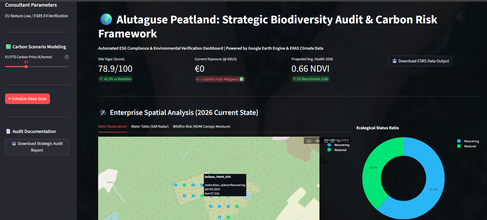

# 🌲 Selisoo Bog Restoration Monitor (Estonia)

### 🛰️ Live Dashboard: [Click Here to View App](https://huggingface.co/spaces/mouparnadhar-climate-risk-analyst/estonia-peatland-monitor)

**A satellite-based automated monitoring system for the 2,051-hectare Selisoo Bog in Alutaguse National Park, aligned with the EU Nature Restoration Law (2024).**

## 🌍 The Problem
Estonia must restore 30% of its drained peatlands by 2030 (EU Nature Restoration Law). Traditional monitoring requires expensive manual field surveys. The Selisoo Bog, located near critical oil shale mining operations, requires constant hydrological monitoring to ensure restoration success.

## 🛠️ The Solution
I built a Python-based automated dashboard that uses **Google Earth Engine (GEE)** to analyze 10 years of satellite data instantly.

*   **Vegetation Health:** Sentinel-2 Optical Data (NDVI) to detect Sphagnum moss recovery.
*   **Soil Moisture:** Sentinel-1 Radar (SAR) to see water tables through clouds.
*   **Financial Risk:** Calculates Carbon Liability (€) based on CSRD emission factors.

## 💻 Tech Stack
*   **Remote Sensing:** Google Earth Engine (Python API), Sentinel-1, Sentinel-2
*   **Backend:** Python, Pandas, NumPy
*   **Frontend:** Streamlit, Plotly (Interactive Maps & Charts)
*   **Deployment:** Streamlit Cloud (CI/CD via GitHub)

## 📊 Key Features
1.  **3-Layer Interactive Map:** Toggle between Restoration Status, Vegetation, and Moisture.
2.  **Automated Risk Scoring:** Algorithms classify sites as *Restored*, *Recovering*, or *Degraded*.
3.  **10-Year Time-Series:** Dual-axis charts showing historical recovery trends (2017-2024).
4.  **CSRD Financial Modeling:** Estimates carbon sequestration loss in Euros.

## 📄 Documentation
[Download the Methodology Report (PDF)](Selisoo_Restoration_Report.pdf) inside the app.

---
*Created by Mouparna Dhar | Climate Risk Analyst*
